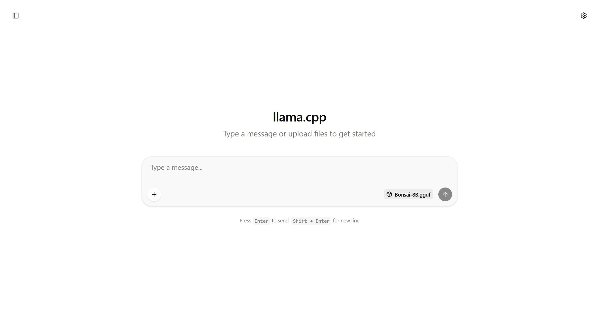
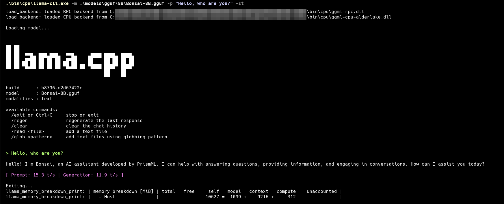
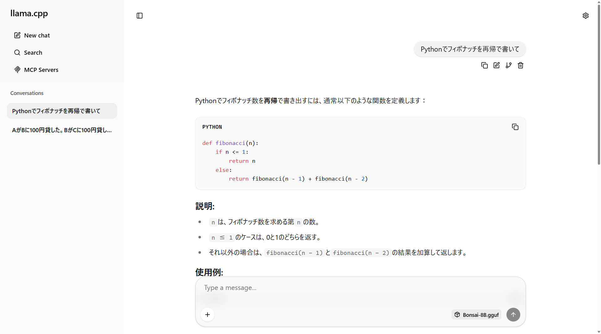
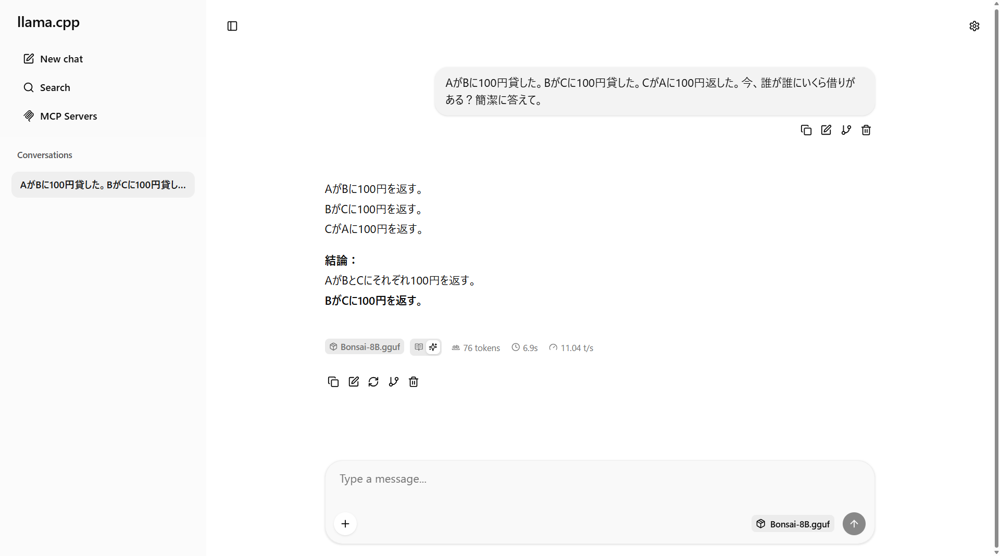

# Bonsai 1-Bit LLM

[](https://huggingface.co/prism-ml/Bonsai-8B-gguf)
[](https://huggingface.co/prism-ml/Bonsai-8B-gguf)

8Bモデルが1GBに収まる。1ビットLLM **Bonsai 8B** をローカルで動かした実験記録。セットアップから実行結果、弱点まで。

```
通常の8Bモデル:  ████████████████ 16GB
Bonsai 8B:      █ 1.15GB
```

## Bonsai 8B とは

PrismMLが開発した1ビットLLM。8B（80億個）のパラメータを持つモデルで、ファイルサイズが **1.15GB** 。

LLMの中身は数十億個の数値の集まりで、これが **重み** 。「猫」と「動物」はつながりが強い、「猫」と「経済学」はほぼ関係ない。こういう言葉同士の関係性の強さが1個1個の数値になってる。普通のモデルはこの数値を65,536通り（16ビット）の精度で持ってる。

Bonsaiはこれを **-1 と +1 の2択** にした。後から精度を落としたんじゃなくて、最初から2択で訓練してる。

- ベースモデル: Qwen3-8B
- ファイルサイズ: 1.15GB（通常の8Bモデルは16GB前後）
- GPUなし、CPUだけで動く
- ライセンス: Apache 2.0

## セットアップ

PrismMLのデモリポにモデルダウンロードとバイナリ取得のスクリプトが入ってる。

```bash
git clone https://github.com/PrismML-Eng/Bonsai-demo.git
cd Bonsai-demo
```

### macOS / Linux

```bash
./setup.sh
```

### Windows

setup.ps1 でモデルとバイナリをまとめて取得できるが、Windowsだとバイナリのzip展開がうまくいかないことがある。確実に動かすなら手動セットアップがおすすめ。

**方法1: setup.ps1（自動）**

```bash
powershell.exe -ExecutionPolicy Bypass -File ./setup.ps1
```

動かなかった場合（`bin/` 内に `llama-cli.exe` がない場合）は方法2へ。

**方法2: 手動セットアップ（確実）**

まず方法1の `setup.ps1` を実行してモデルだけ取得する。その後、バイナリを手動で入れる。

```bash
curl -L -o llama-cpu.zip "https://github.com/PrismML-Eng/llama.cpp/releases/download/prism-b8796-e2d6742/llama-bin-win-cpu-x64.zip"
mkdir -p bin/cpu && unzip -o llama-cpu.zip -d bin/cpu && rm llama-cpu.zip
```

モデルは1GBなのでダウンロードは数分で終わる。

## 使い方

### ブラウザで使う（サーバーモード）

```bash
# macOS / Linux
./scripts/start_llama_server.sh

# Windows
./bin/cpu/llama-server.exe -m ./models/gguf/8B/Bonsai-8B.gguf --host 127.0.0.1 --port 8080
```

`http://127.0.0.1:8080` を開く。終了は `Ctrl+C`。



### ターミナルで使う（CLIモード）

```bash
# ワンショット（1回だけ回答して終了）
# macOS / Linux
./scripts/run_llama.sh -p "What is the capital of France?" -st

# Windows
./bin/cpu/llama-cli.exe -m ./models/gguf/8B/Bonsai-8B.gguf -p "Hello, who are you?" -st
```

`-p` で質問、`-st` で1回だけ回答して終了。`-st` を外すと対話モード。



## デモ: Node.jsから直接呼び出す

サーバー不要。llama-cliを直接叩いて回答を取得する。

### 前提

- 上の「セットアップ」が完了していること（Bonsai-demoにモデルとバイナリがある状態）
- Node.js がインストールされていること

### 実行

```bash
# bonsai-1bit-llm のルートで実行。BONSAI_DIR でBonsai-demoの場所を指定する
BONSAI_DIR=./Bonsai-demo node demo/chat.mjs "Pythonでフィボナッチを再帰で書いて"
```

OS自動判定、バイナリ・モデルの存在チェック付き。`-c 8192` でメモリを抑えてる。

## 実験結果

Windows（CPU、GPUなし、32GB RAM）で実行。

### 速度

文字がスルスル出てくる。待たされるストレスはない。

| 指標 | 値 |
|------|-----|
| Prompt処理 | 15.1 tokens/s |
| 生成速度 | 11.5 tokens/s |

### コード生成

「Pythonでフィボナッチを再帰で書いて」と日本語で投げたら、再帰関数を正しく書いた上にメモ化版まで提案してきた。



### 推論の弱点

循環する債務の相殺（A→B→C→Aで全員チャラ）は理解できなかった。多段推論は苦手。



### ベンチマーク（PrismML発表値）

| ベンチマーク | Bonsai 8B | Llama 3 8B |
|------------|-----------|------------|
| MMLU（汎用知識） | 68.4 | 66.6 |
| HumanEval（コード生成） | 62.2 | 62.2 |
| MMLU-Pro（複雑な推論） | 65.7 | — |

1GBでLlama 3 8Bに匹敵するスコアが出てる。ただし込み入った推論は苦手で、同じ8BのQwen3（MMLU-Pro: 83）とは差がある。自社評価なので割り引いて見る必要がある。

## メモリ使用量

ファイルは1.15GBだけど、実行時は推論用の作業メモリ（KVキャッシュ）が別途必要。

| コンテキストサイズ | メモリ使用量 | 出典 |
|---|---|---|
| 8,192トークン（`-c 8192`） | 約1.2GB | 実測 |
| 32,768トークン | 約5.9GB | PrismML README |
| 65,536トークン（デフォルト） | 約10.5GB | PrismML README |

ワンショットなら `-c 8192` で十分。

## リンク

- [PrismML Bonsai-demo](https://github.com/PrismML-Eng/Bonsai-demo)
- [Bonsai 8B GGUF（Hugging Face）](https://huggingface.co/prism-ml/Bonsai-8B-gguf)
- [PrismML](https://prismml.com)
